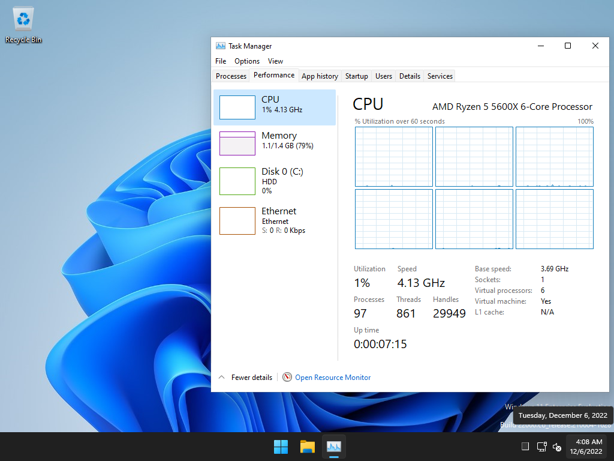

# Setup Workflow for Windows 11

**Windows を快適に使うための PC セットアップ手順**

### こんな人におすすめ

-   余計なプログラムやファイルは出来るだけ排除したい
-   Microsoft 製品は一部を除いて基本的に使わない
-   プライバシーとセキュリティを強化したい
-   PC のスペックが低い、または回線速度に問題がある

### Screenshot



---

## Table of Contents

-   [Table of Contents](#table-of-contents)
-   [Requirements](#requirements)
-   [Dependencies](#dependencies)
-   [Before Get Started](#before-get-started)
    -   [Microsoft アカウントの作成を回避](#microsoft-アカウントの作成を回避)
-   [Installation](#installation)
    -   [スクリプトの編集](#スクリプトの編集)
-   [Usage](#usage)
    -   [Sophia Script for Windows 11](#sophia-script-for-windows-11)
    -   [メインスクリプトの実行](#メインスクリプトの実行)
    -   [プライバシーとセキュリティの強化](#プライバシーとセキュリティの強化)
-   [Personal Settings](#personal-settings)
    -   [各種設定ファイルの配置](#各種設定ファイルの配置)
    -   [不要なサービスの停止](#不要なサービスの停止)
    -   [Hyper-V の有効化](#hyper-v-の有効化)
-   [Note](#note)
-   [ブラウザ設定（LibreWolf）](#ブラウザ設定librewolf)
    -   [Installation](#installation-1)
    -   [Update](#update)
    -   [拡張機能の導入](#拡張機能の導入)
    -   [`uBlockOrigin` の上級者設定](#ublockorigin-の上級者設定)
        -   [追加フィルタ（Optional）](#追加フィルタoptional)
    -   [about:config で変更したい箇所](#aboutconfig-で変更したい箇所)
-   [AutoHotkey](#autohotkey)
-   [日本語フォント](#日本語フォント)

---

## Requirements

-   Windows 11 Home | Pro | EnterPrise | Insider

## Dependencies

-   [Scoop]
-   [O&O ShutUp10]
-   [Sophia Script for Windows]

---

## Before Get Started

以下の手順は、OS のインストールが終わり PC の初期設定が終わった直後に実行することを推奨しています。そのため、PC の初期設定時に Microsoft アカウントの作成を回避する方法を紹介しておきます。

### Microsoft アカウントの作成を回避

1. インターネット設定画面で、<kbd>Alt</kbd> + <kbd>F4</kbd> を押して設定プロセス自体を終了させてしまう

2. 上記の方法でインターネット接続を回避できなかった場合、Microsoft アカウント設定画面で、<kbd>Shift</kbd> + <kbd>F10</kbd> を押してコマンドプロンプトを立ち上げ、以下のコマンドを入力しインターネット接続を一時的に切断する（Wi-Fi の場合）

```CMD
X:\Sources> netsh wlan disconnect
X:\Sources> exit
```

> 有線の場合はケーブルを抜くか、ルーターの電源を一回落とす。また、<kbd>Windows</kbd> + <kbd>R</kbd> で「ファイル名を指定して実行」を起動し、`taskmgr` と入力してタスクマネージャーを起動。ネットワークに関連するプロセスを探してタスクを終了させてもいい。

コマンドプロンプトが閉じたら左上の戻る矢印をクリック

## Installation

<kbd>Windows</kbd> キーを押して、検索窓に「shell」と入力して <kbd>Enter</kbd> で `Windows PowerShell` を起動

以下のコマンドをコピーして張り付け

```powershell
Set-ExecutionPolicy RemoteSigned -Scope CurrentUser

irm get.scoop.sh | iex

scoop install 7zip mingit gsudo pwsh
scoop update

git clone https://github.com/demerara151/setup-new-pc.git

```

一度 `Windows PowerShell` を終了し、<kbd>Windows</kbd> キーを押して `PowerShell Core` を探して起動

### スクリプトの編集

-   [Sophia.ps1](/Sophia/Sophia.ps1)
    <!-- TODO: Write how to edit guide. -->

    メモ帳で開き、中身を自分好みに編集。もしくは、別の PC で事前に編集しておく

-   [installAll.ps1](/installAll.ps1)
    <!-- TODO: Write examples. -->

    メモ帳で開き、不要なアプリが含まれていないか確認する。不要なアプリ名を削除、もしくは、各行のコマンドの先頭に `#` を付けることでコマンドの実行を防ぐ

---

## Usage

### Sophia Script for Windows 11

> ⚠️OS のインストール直後に実行するのがベストのため、既に PC を普段使いしているなら以下のスクリプトは使用せず、[Sophiapp] を利用してください

事前にスクリプトを編集した上で、以下のコマンドをコピーしてターミナルに張り付け

```powershell
Set-ExecutionPolicy -ExecutionPolicy Bypass -Scope Process -Force
sudo ~/setup-new-pc/Sophia/Sophia.ps1

```

プログラムが終了し、PC を再起動するようメッセージが表示されたら、PC を再起動

-   実行に失敗した場合、

    1. `Windows Update` の実行
    2. `PoserShell`、または PC の再起動
    3. `PowerShell` のバージョンがスクリプトの要件を満たしているか確認

### メインスクリプトの実行

PC の再起動後、再度 `PowerShell Core` を起動して次のスクリプトを実行

```powershell
~/setup-new-pc/scripts/installAll.ps1

```

必要なアプリがまとめてインストールされます

### プライバシーとセキュリティの強化

アプリのインストール完了後、自動的に以下のアプリが立ち上がるので、以下のように設定

-   [O&O ShutUp10]

    -   `Actions` から `Recommended and somewhat recommended settings` を選択

## Personal Settings

以下は個人的な設定です。適用する場合は、必ずファイルの中身を**事前に確認**してください

### 各種設定ファイルの配置

現在設定ファイルは [chezmoi] で管理しています。設定ファイルをダウンロードして適用するには、`chezmoi init <repo>` します

```powershell
chezmoi init https://codeberg.org/Gambling1594/dotfiles.git

```

中には暗号化されているファイルもあり復号できずにエラーとなるため、適用する前に削除します

```powershell
Get-ChildItem ~/.local/share/chezmoi -Include encrypted_* -Recurse | Remove-Item

```

次に、実際に設定ファイルをあるべき場所に配置します。これは、以前まで使っていた `~/.config` フォルダーではなく、プログラムによって決められたデフォルトの設定ファイルの場所にファイルを展開します

> ⚠️ 全ての既存の設定ファイルの内容が上書きされます。既存の設定ファイルがあるならバックアップをとっておくか、適用したくない設定ファイルは事前に `~/.local/share/chezmoi` の中から削除しておいてください

```powershell
chezmoi apply

```

### 不要なサービスの停止

個人的に全く使わない以下のサービスをまとめて停止します

-   印刷
-   ファックス
-   IPv6
-   ダイレクトアクセス
-   位置情報
-   IoT 家電
-   デジカメ、スキャナー
-   リモートレジストリ
-   Windows 検索
-   Microsoft Edge 自動アップデート
-   ネットワークデータ使用状況
-   Xbox gaming

```powershell
sudo ~/setup-new-pc/scripts/stopService.ps1

```

> 詳細は、[stopService.ps1](/scripts/stopService.ps1) 及び、[windows-service](/docs/windows-service.md) で確認できます

### Hyper-V の有効化

BIOS で「ハードウェアの仮想化サポート」が有効になっている前提で、

```Powershell
sudo ~/setup-new-pc/scripts/hyper-v/hv.bat

```

> もし、_Windows Insider Program_ への参加が条件で `Hyper-V` が実行できない場合は、[OfflineInsiderEnroll] をインストール（`scoop install offlineinsiderenroll`）することで、Microsoft アカウントの作成を回避して _Windows Insider Program_ へ参加可能

## Note

-   Microsoft Edge をアンインストールすると、ログイン時にフリーズして PC が使用できなくなる不具合に遭遇。開発環境だけの問題かもしれないけど、怖いのでそのままにしておくことにする

---

## ブラウザ設定（LibreWolf）

### Installation

> ! winget の使用を中断しているため、手動でのインストールになります

まず、ポータブル版を今まで通りインストールします。

```powershell
scoop install librewolf
librewolf.exe

```

そのポータブル版で <https://librewolf.net/installation/windows> を開いて、最新版のインストーラーをダウンロードします

インストールが終わったら Windows の設定を開き、アプリ > 既定のアプリ で LibreWolf を選択し、一番上にある「既定値に設定」をクリックして LibreWolf を既定のアプリに設定します

### Update

LibreWolf 自身には自動アップデート機能は付いていません。アップデートする際は、毎回上記のページを開いて最新版をダウンロードし、インストーラーを実行する必要があります

幸い、非公式ですが、アップデートがあったら知らせてくれる拡張機能 [LibreWolf Updater extension] があります。毎日ページを開いて確認するのが面倒な人は、こちらの拡張機能の利用を検討してください

[librewolf updater extension]: https://addons.mozilla.org/en-US/firefox/addon/librewolf-updater/

### 拡張機能の導入

> 💡`uBlockOrigin` は、最初からインストールされています

-   [DarkReader] 常にダークモード
-   [LibRedirect] プライバシーを尊重するサイトへ自動リダイレクト
-   [KeePassXC-Browser] パスワード管理

    導入手順: <https://keepassxc.org/docs/KeePassXC_GettingStarted.html#_setup_browser_integration>

### `uBlockOrigin` の上級者設定

1. 設定画面の `I am an advanced user` にチェック
2. デフォルトのフィルターを全て適用
3. `My rules` タブに、次の 2 行を追加
    ```
    * * 3p-frame block
    * * 3p-script block
    ```

#### 追加フィルタ（Optional）

-   AdGuard Social Media
-   [oisd]
-   [1Hosts Pro]
-   [Energized Ultimate Protection]
-   [Energized Xtreme Extension]

> PC のスペックが低い場合、これらのフィルターを全て適用するとかなり重たくなります。特に、`Energized ~` は強力ですがその分重たくなるので、様子を見ながら適度に適用してください。初めは `oisd` だけ適用するのがよさそうです

### about:config で変更したい箇所

| key                                                | default | new  | description                        |
| :------------------------------------------------- | :-----: | :--: | :--------------------------------- |
| network.http.max-persistent-connections-per-server |    6    |  8   | 1 つのサーバーに対する最大接続数   |
| browser.tabs.loadBookmarksInTabs                   |  false  | true | ブックマークを常に新しいタブで開く |

---

## [AutoHotkey](/.config/AutoHotkey/KeySwapV2.ahk)

-   10/21 更新: _AutoHotkey のバージョンを `Version 1.1.34.04` から `Version 2.0-beta.12` へアップグレード。_ 既存のバージョンとの互換性はないため、以前のスクリプトを削除。スクリプトファイル、及び実行ファイルのパスも変わっているため注意

-   12/22 更新: AutoHotkey が正式にバージョン 2.0 に昇格したため、名前が AutoHotkey V2 から AutoHotkey へ戻りました

> 参照: <https://lexikos.github.io/v2/docs/AutoHotkey.htm>

英語配列キーボード向けのキーの挙動変更。入れ替えるキーは以下の 2 つ

|  1  | <kbd>;</kbd>  セミコロン | <kbd>:</kbd>  コロン |
| :-: | :----------------------- | :------------------- |
|  2  | <kbd>CapsLock</kbd>      | <kbd>ESC</kbd>       |

> `chezmoi init <repo>` でスクリプトを配置していたなら、PC の再起動後に既定のプログラムを設定するようポップアップが出るので、`~/scoop/apps/autohotkey/current/v2/AutoHotkey64.exe` を選択

> または、Windows の設定 > アプリ > 既定のアプリで、ファイルの種類の既定値を設定する。上部の窓に、`.ahk`と入力して上記のプログラムをエクスプローラーから探して選択

## 日本語フォント

必要に応じて手動でインストール

-   [RocknRoll One](https://github.com/fontworks-fonts/RocknRoll): 現在 `foobar2000` のプレイリストにフォント適用中

<!-- Link Reference -->

<!-- Dependencies -->

[scoop]: https://scoop.sh
[o&o shutup10]: https://www.oo-software.com/en/shutup10
[sophia script for windows]: https://github.com/farag2/Sophia-Script-for-Windows

<!-- Optional Dependencies -->

[chezmoi]: https://www.chezmoi.io
[sophiapp]: https://github.com/Sophia-Community/SophiApp/
[offlineinsiderenroll]: https://github.com/abbodi1406/offlineinsiderenroll

<!-- Browser Addons -->

[keepassxc-browser]: https://addons.mozilla.org/en-US/firefox/addon/keepassxc-browser/
[darkreader]: https://addons.mozilla.org/en-US/firefox/addon/darkreader/
[libredirect]: https://addons.mozilla.org/en-US/firefox/addon/libredirect/

<!-- AdBlock Filter -->

[oisd]: https://oisd.nl/
[1hosts pro]: https://github.com/badmojr/1Hosts
[energized ultimate protection]: https://filterlists.com/lists/energized-ultimate-protection
[energized xtreme extension]: https://filterlists.com/lists/energized-xtreme-extension
